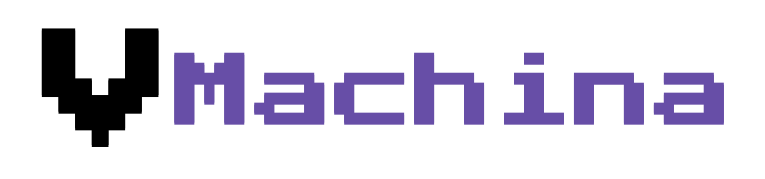

# 
An Extensible Stack Virtual Machine written in Javascript. The Machine itself is completly extensible with facility to add **custom operations** to it with complete control over **internal datastructures** consisting of **infinte stack** and **infinte memory** to modify and transform it to your needs. It also allows you to create operations with parameters like push which can take **variable arguments** and also work with **variable operands** from the stack.

### `Example Usage`
```javascript
const m = new vMachina();
m.run([
    ["push",10],
    ["push",8],
    ["call"],
    ["push",10],
    ["push",20],
    ["add"],
    ["print"],
    ["halt"],
    ["push",2],
    ["multiply"],
    ["print"],
    ["ret"]
]);
```

### `Operations`

| Operation 	| Operands 	|                                                   Behaviour                                                  	|
|:---------:	|:--------:	|:------------------------------------------------------------------------------------------------------------:	|
|    push   	|     -    	| Pushes a Value on the Stack                                                                                  	|
|    pop    	|     -    	| Pops a Value from the Stack                                                                                  	|
|    add    	|     2    	| Pops 2 Values from Stack adds them then pushes the sum                                                       	|
| substract 	|     2    	| Pops 2 Values from Stack substracts them then pushes the diff                                                	|
|   divide  	|     2    	| Pops 2 Values from Stack divides them then pushes the quotient                                               	|
|  multiply 	|     2    	| Pops 2 Values from Stack multiplies them then pushes the product                                             	|
|    load   	|     1    	| Pops a Value from the Stack goes to that location in the memory and pushes its value                         	|
|   store   	|     2    	| Pops 2 Values (value,location) from Stack goes to that location in the memory and stores the value           	|
|    jump   	|     1    	| Pops a Value from the Stack and jumps to the location                                                        	|
|     jz    	|     2    	| Pops 2 Values (location,value) from Stack goes to that location if value is 0                                	|
|    jnz    	|     2    	| Pops 2 Values (location,value) from Stack goes to that location if value is not 0                            	|
|    call   	|     1    	| Pops a Value from the Stack store the current location in the Pointer Stack and jumps to the location popped 	|
|    ret    	|     -    	| Pops a Value from the Pointer Stack and returns/jumps to that location                                       	|
|    swap   	|     2    	| Pops 2 Values and pushing them in the reverse order which swaps them                                         	|
|   print   	|     1    	| Pops a Values from the Stack and prints it                                                                   	|
|    halt   	|     -    	| Halts the machine                                                                                            	|
